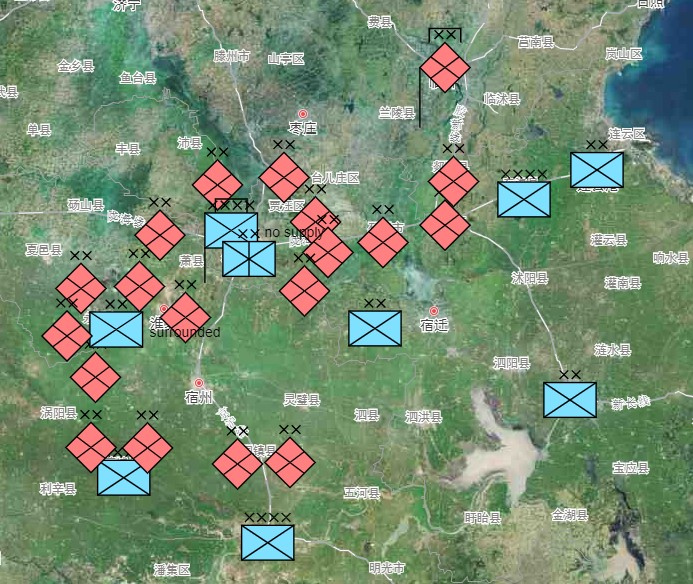

# Amap Railway Map 高德铁路地图

## Control

- `w` move up
- `a` move left
- `s` move down
- `d` move right
- `g` game mode
- `r` spawn Redfor infantry on mouse position
- `b` spawn Bluefor infantry on mouse position
- `l` load last saved game
- `;` save game(info displayed in console`F12`)
- `z` toogle NATO symbol z-index
- `RMB` delete symbol
- `LMB` move(drag) symbol
- `]` increase size of symbols
- `[` decrease size of symbols
- `\` reset size of symbols

